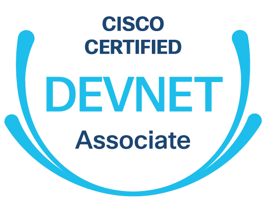

# cURL & Python Requests Foundations Hands-On Walkthrough

## About

What's the big fuss over IT automation?  Well, more than anything, the excitement is about the sorts of things that you _don't_ have to do when automation is on your side.  Things like _not_ having to either copy and paste configuration changes to dozens (maybe hundreds) of different systems or repeat the same click, click, click, click, click-through-the-UI marathon over, and over, and over..._every single time_ there's a need to make a bulk change :rage:.  To automate these sorts of workflows, you need to learn to write some form of automation-specific code, and that code needs to interact with IT systems using some form of API, usually a **REST API**.

---

## Overview

This repository has a variety of hands-on, step-by-step exercies that will teach you to use [cURL](https://curl.se "cURL Homepage") and Python [Requests](https://docs.python-requests.org/ "Python Requests Homepage") to work with REST APIs. Even if you are new to cURL or Python Requests, this walkthrough will help you learn the syntax for both tools and get you comfortable with REST API calls to several Cisco platforms, including:

- ACI
- DNA Center
- Meraki
- vManage SD-WAN
- Webex

Each of these REST APIs uses different authentication mechanisms, URI endpoints, and payload formats, so you will learn to work REST APIs in a variety of different ways. Even if you're thinking, _"I don't work with Cisco products, why should I care about Cisco APIs?"_ If you complete the hands-on exercises in this repository, you should be able to work with just about _any_ REST API, which means you will have some mega automation superpowers.

You'll get the most from the hands-on exercises if you have at least a little bit of exposure to Python fundamentals, although we put the step-by-step directions together in a way that welcomes all experience levels.

## Usage

Navigate to [https://wwt.github.io/curl-requests-foundations](https://wwt.github.io/curl-requests-foundations) and follow the guided walkthrough instructions.
