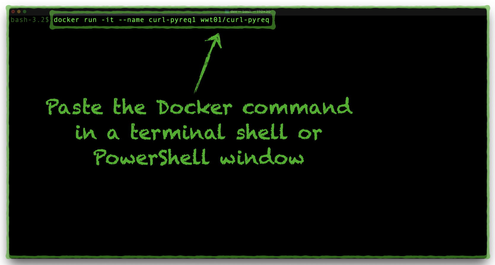
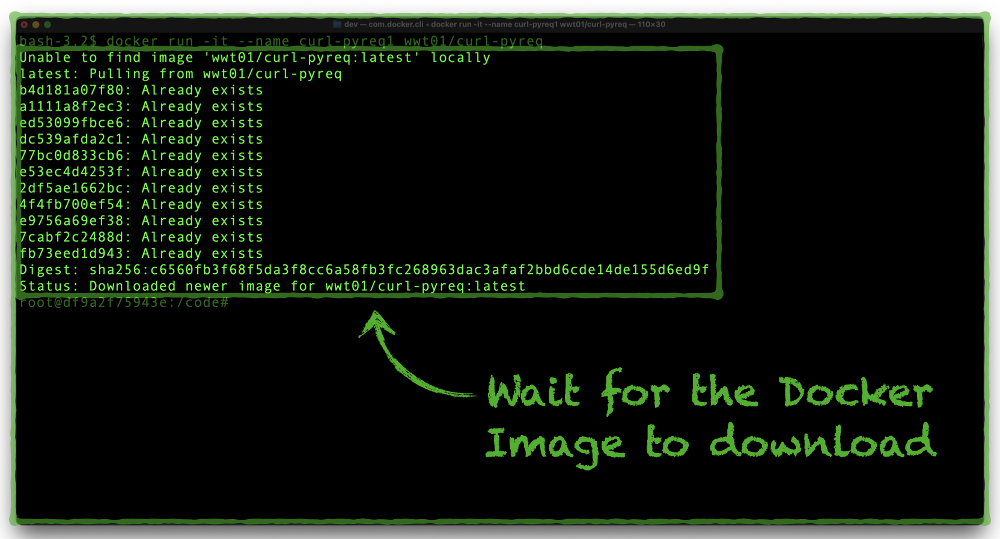
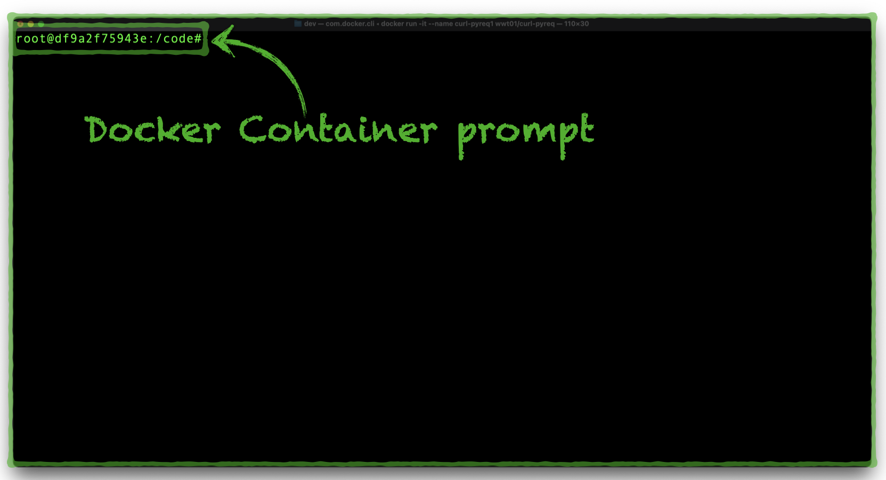
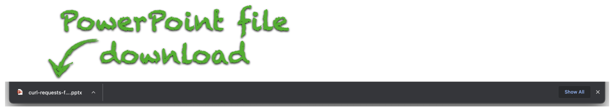
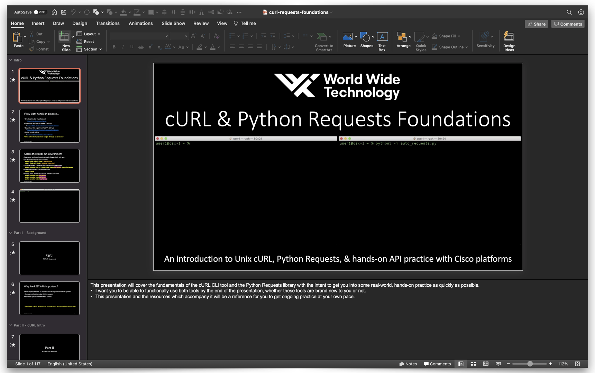
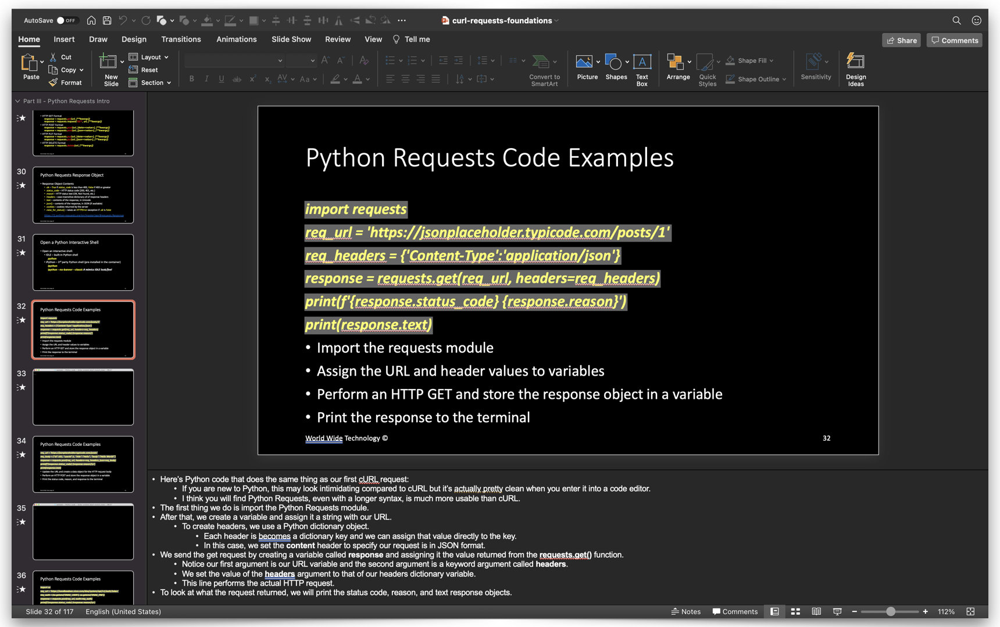
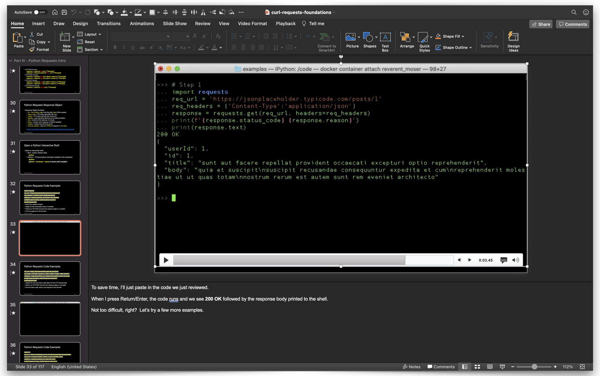
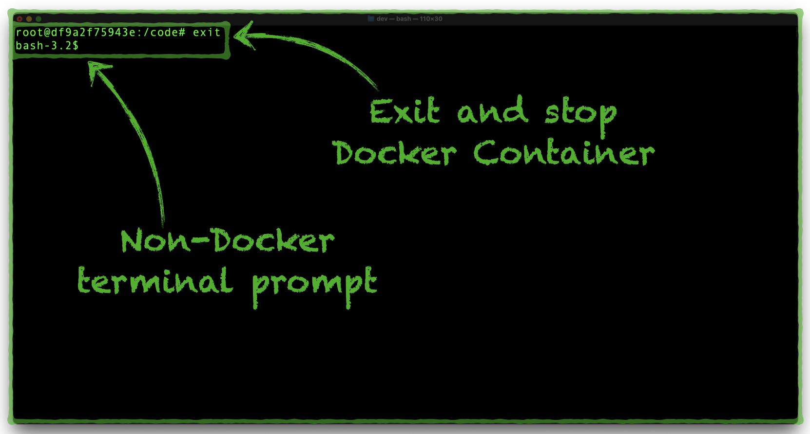

# Hands-On Exercises

## :fontawesome-solid-flask: Lab Overview

The lab environment runs in a Docker Container and contains references for all of the **cURL** scripts and **Python Requests** code that you will build.  A PowerPoint Presentation file will guide you through each of the following exercises:

1. **cURL** Introduction.
2. **Python Requests** Introduction.
3. ACI[^1]
4. DNAC[^1]
5. Meraki[^1]
6. vManage SD-WAN[^1]
7. Webex[^1]

---

## :fontawesome-solid-tools: Lab Requirements

You only need a few things to start working through the hands-on exercises:

1. :fontawesome-brands-docker: A Docker runtime environment.

    - [Docker Desktop for Windows or macOS](https://www.docker.com/products/docker-desktop "Docker Desktop for Windows or macOS"){target=_blank}
    - [Docker for Linux](https://hub.docker.com/search?offering=community&operating_system=linux&q=&type=edition "Docker for Linux"){target=_blank}.

2. :material-microsoft-visual-studio-code: An IDE tool[^2].

    - We recommend [Visual Studio Code](https://code.visualstudio.com/Download "Visual Studio Code Download"){target=_blank}.

2. :fontawesome-solid-terminal: A terminal program.

    - [Visual Studio Code Integrated Terminal](https://code.visualstudio.com/docs/editor/integrated-terminal "Visual Studio Code Integrated Terminal"){target=_blank}.
    - [Microsoft PowerShell](https://docs.microsoft.com/en-us/powershell/scripting/install/installing-powershell-core-on-windows?view=powershell-7.1 "PowerShell Installation Instructions"){target=_blank}.
    - [macOS Terminal application](https://support.apple.com/guide/terminal/welcome/mac "macOS Terminal Application"){target=_blank}.

3. :material-file-powerpoint-box: [Microsoft PowerPoint](https://support.microsoft.com/en-us/office/view-a-presentation-without-powerpoint-2f1077ab-9a4e-41ba-9f75-d55bd9b231a6 "View a PowerPoint Presentation"){target=_blank}.

---

## :material-beaker: Lab Setup Instructions

Follow these steps to set up the hands-on lab environment:

???+ example "Lab Setup Directions"

    !!! attention

        - This option assumes you have an operational Docker runtime environment and that your Docker daemon can connect to and download images from [Docker Hub](https://hub.docker.com/repository/docker/wwt01/curl-pyreq "Lab Image on Docker Hub){target=_blank}.
        - The screenshots in the directions represent an example from a **macOS Terminal**, and the same commands and procedures also work with **Windows PowerShell**.

    ???+ todo "Step 1"

        1. Copy the following command to your clipboard.

            ```bash
            docker run -it --name curl-pyreq1 wwt01/curl-pyreq
            ```        

        2. Open a terminal shell on the same system as your Docker runtime environment.
        3. Paste the command into your terminal shell.
        4. Press your ++enter++ or ++"Return"++ key to run the command.

        [](../images/docker_container/1_docker_run.png){target=_blank}

        [](../images/docker_container/2_docker_pull.png){target=_blank}

        !!! tip

            You will know your Container is active and ready for use when your terminal prompt changes to something like this:

            ```bash
            root@da343f292e5a:/code#
            ```

            [](../images/docker_container/3_docker_container_prompt.png){target=_blank}

        ??? help "Docker Command Details"

            The Docker Command performs the following actions:

            1. Downloads the **wwt01/curl-pyreq** Docker Image from [Docker Hub](https://hub.docker.com/repository/docker/wwt01/curl-pyreq "Lab Image on Docker Hub){target=_blank}.
            2. Creates a new Docker Container with the name **curl-pyreq1**
            3. Attaches to the Container shell.

    ??? todo "Step 2"

        Click the botton below to download the instructional Microsoft PowerPoint slides:

        <div align="center" target="_blank">[Download Presentation :fontawesome-solid-file-powerpoint:](https://github.com/wwt/curl-requests-foundations/raw/main/curl-requests-foundations.pptx){ .md-button }</div>

        [](../images/docker_container/4_powerpoint_download.png){target=_blank}

    ??? todo "Step 3"

        Open the PowerPoint Presentation.

        [](../images/docker_container/5_powerpoint_slides.png){target=_blank}

    ??? todo "Step 4"

        Complete each of the exercises, in sequence:

        1. The slides provide command examples for you to follow:
        
            [](../images/docker_container/6_powerpoint_code_example.png){target=_blank}

        2. The presenter notes provide step-by-step instructions to guide you through each slide and exercise.
        3. After each **cURL** command entry or **Python Requests** code run, a slide with a screen recording will show you what you should expect to see:
        
            [](../images/docker_container/7_powerpoint_screen_recording_example.png){target=_blank}

        4. Enter the **cURL** command examples in your Container prompt.
        5. Use the Container's Python REPL to enter the **Python Request** code examples.

        !!! attention

            There may be some slight variances between the output in the screen recordings and the output in your Docker environment, although each of the **cURL** commands and **Python Requests** code blocks should run successfully.

    ??? help "Lab Environment Shutdown and Restart"

        To shut down the lab environment, from your terminal window press ++ctrl+d++ and wait for the terminal prompt to change back to its standard development computer prompt.

        [](../images/docker_container/8_docker_stop_and_exit.png){target=_blank}

    ??? note "Lab Environment Docker Command Reference"

        Use the following commands to manage your Docker lab environment:

        - Restart an existing lab environment Container (restores previous lab progress):

        ```bash
        docker start curl-pyreq1
        ```

        - Delete an existing lab environment Container (removes previous lab progress):

        ```bash
        docker stop curl-pyreq1
        docker rm curl-pyreq1
        ```

        - Remove the Docker Image:

        ```bash
        docker stop curl-pyreq1
        docker rm curl-pyreq1
        docker rmi wwt01/curl-pyreq
        ```

---

## :fontawesome-solid-lightbulb: Tips

1. Start the PowerPoint presentation in _slide show_ mode for an authentic step-by-step walkthrough experience.

    - Slide animations will advance through a series of small, more consumable steps.
    - If you have a second monitor, you can click through the slide show and read the instructions in the presentation script simultaneously.

2. The Git repository includes a [resources](https://github.com/wwt/curl-requests-foundations/tree/main/resources "resources Folder"){target=_blank} directory where you can find subdirectories, organized by topic and REST API platform.

    - All of the shell scripts and Python code in the PowerPoint slides, are in [curl](https://github.com/wwt/curl-requests-foundations/tree/main/resources/curl "curl Folder"){target=_blank} and [python](https://github.com/wwt/curl-requests-foundations/tree/main/resources/python "python Folder"){target=_blank} subdirectories.
    - Both the [curl](https://github.com/wwt/curl-requests-foundations/tree/main/resources/curl "curl Folder"){target=_blank} and [python](https://github.com/wwt/curl-requests-foundations/tree/main/resources/python "python Folder"){target=_blank} directories contain subdirectories for each section of the presentation (examples, ACI, DNAC, etc.).
    - Keep the Git repository open in a browser window if you want a quick reference for any of the **cURL** commands or **Python Requests** code.

---

## :fontawesome-brands-git-alt: Feedback, Issues, & Contributions

What can you do you need some help?  If you:

- Run into a problem with the lab.
- Have a question about the presentation content.
- Want to make a suggestion
- Want to make your own contribution to this project.

**Please**, open an [Issue](https://github.com/wwt/curl-requests-foundations/issues "Repository Issues Page"){target=_blank} or create a [Pull Request](https://github.com/wwt/curl-requests-foundations/pulls "Repository Pull Requests Page"){target=_blank}.  This repository is a community project, and your feedback will make the learning experience better for you and those who follow you in their learning journeys.

[^1]: Includes the following sub-sections: Platform-Specific API Overview, **cURL** REST API exercises, and **Python Requests** REST API exercises.
[^2]: Optional. You may use the Python REPL in the Docker Container to enter the **Python Requests** code examples.

--8<-- "includes/glossary.txt"
